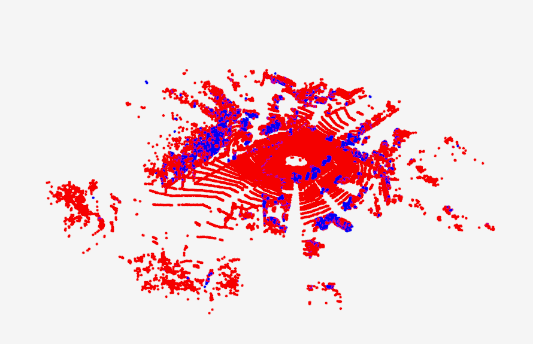
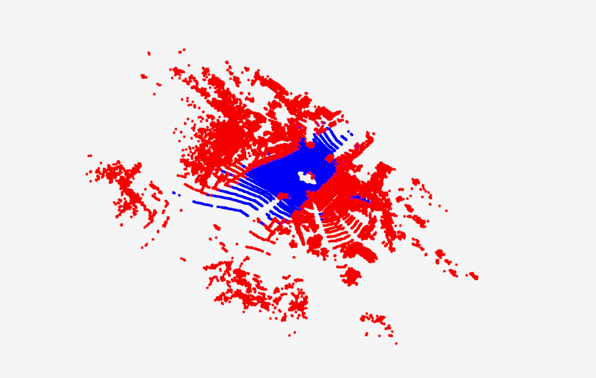
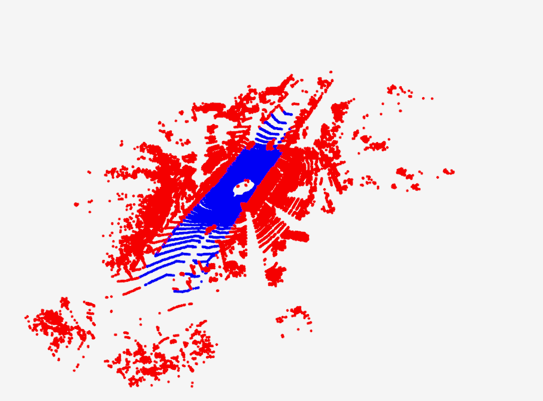

# pc_superposition

安装依赖：pip install open3d-python

点云个数：124230

图片中红的点为非地面点，蓝色的点为地面点
## 地面过滤算法
地面点个数：103483

运行时间：1.92s

## 点云分割算法
地面点个数：59575

运行时间：0.22s

## ground_truth
地面点个数:61529

两个算法对比：
    地面过滤算法过滤的地面点太多了，很多感觉是非地面点都被过滤了，地面分割算法过滤地面的准确率和标注的数据相近。运行时间，地面过滤算法明速度慢于点云分割算法。