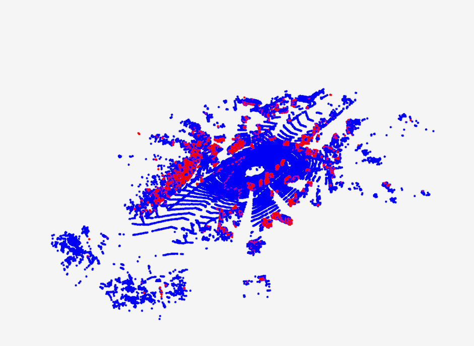

# pc_superposition

# 地面过滤
安装依赖：pip install open3d-python

点云个数：124230

图片中红的点为非地面点，蓝色的点为地面点
## 地面过滤算法
地面点个数：103483

运行时间：1.92s



## 点云分割算法
地面点个数：59575

运行时间：0.22s


## ground_truth
地面点个数:61529


两个算法对比：
    地面过滤算法过滤的地面点太多了，很多感觉是非地面点都被过滤了，地面分割算法过滤地面的准确率和标注的数据相近。运行时间，地面过滤算法明速度慢于点云分割算法。】


# 点云叠加

## 加载calib
 calib.txt有5个矩阵，用tr矩阵，他是一个大小为3*4的矩阵，用来将相机视角投影到elodyne视角下。代码将这个矩阵补长成为4*4的方阵。
 ```
    Eigen::Matrix4f m = Eigen::Matrix4f::Identity();
    for (uint32_t i = 0; i < 12; ++i) {
        m(i / 4, i - int(i / 4) * 4) = boost::lexical_cast<float>(rv::trim(entries[i]));
    }

 ```

## 加载pose
semantic-kitti的数据集给了poses.txt。每一个sequence对应了一个poses.txt，poses每一行对应每一帧的一个转移矩阵，可以将每一帧的坐标投影导第一帧的坐标系下。poses.txt的原始大小为12(3*4)，代码将这个矩阵补成4*4的方阵，通过定义一个4*4的单位矩阵，然后把单位矩阵前三行赋值成poses.txt的转移矩阵。
```
    Eigen::Matrix4f P = Eigen::Matrix4f::Identity(); //定义单位矩阵
    for (uint32_t i = 0; i < 12; ++i) {
      P(i / 4, i - int(i / 4) * 4) = boost::lexical_cast<float>(rv::trim(entries[i]));
    }
```

## 将pose从相机坐标下转换到velodyne下
用tr矩阵的逆矩阵乘上pose再撑上tr矩阵。

## 分割整体点云空间
整体的点云空间被分成了一定个数的tile，叠加的时候是对每个tile内的所有点云帧进行叠加。每个tile的大小是预先确定的，因此对于每个sequence需要确定tile的个数。有了poses后，可以根据每一帧的poses求出每一帧点云对应的真实坐标，然后循环遍历每一帧点云求出来的坐标，然后确定所有点云坐标的最小值和最大值，然后再除上tile的大小，就能够得到tile的个数了，sequence1可以划分成14*20个tile，如下图所示。


代码如下
```
    //先求整个点云空间坐标的范围
    for (uint32_t i = 0; i < poses_.size(); ++i) {
    Eigen::Vector4f t = poses_[i].col(3);
        min.x() = std::min(t.x() - maxDistance_, min.x());
        min.y() = std::min(t.y() - maxDistance_, min.y());
        max.x() = std::max(t.x() + maxDistance_, max.x());
        max.y() = std::max(t.y() + maxDistance_, max.y());
    }
    //然后根据范围计算出tile的个数
    numTiles_.x() = std::ceil((std::abs(min.x()) - 0.5 * tileSize_) / tileSize_) + std::ceil((max.x() - 0.5 * tileSize_) / tileSize_) + 1;
    numTiles_.y() = std::ceil((std::abs(min.y()) - 0.5 * tileSize_) / tileSize_) +
                  std::ceil((max.y() - 0.5 * tileSize_) / tileSize_) + 1;
```

每个tile的数据结构需要包含一个相对于真实空间的坐标，以及那一帧点云是在这个tile里的，还有tile的索引。
```
     struct Tile {
        int32_t i, j;                   // tile coordinates
        std::vector<uint32_t> indexes;  // scan indexes
        float x, y, size;               // actual world coordinates.
    };
```

## 将每一帧点云放到对应的tile里
每个真实空间的坐标好确定，可以直接根据tile_size算出来。主要需要确定哪些帧能够被归在一个tile里进行叠加。由于根据pose可以计算出每一个帧点云的坐标，整体逻辑就是循环便利每一个tile，将每一个tile的坐标和这一帧点云的坐标相减，如果差值小于一个阈值，则将这一帧点云归到这个tile理。这一步有点就是闭环检测，判断哪些帧点云能够放在一起叠加。
```
    for (uint32_t u = 0; u < uint32_t(numTiles_.x()); ++u) {
        for (uint32_t v = 0; v < uint32_t(numTiles_.y()); ++v) {
            auto& tile = tiles_[tileIdxToOffset(u, v)];
            Eigen::Vector2f q = t - Eigen::Vector2f(tile.x, tile.y);
            q[0] = std::abs(q[0]);
            q[1] = std::abs(q[1]);

            // check for exact overlap (see Behley et al., ICRA, 2015)
            if (std::max(q[0], q[1]) > e[0] + maxDistance_) continue;  // definitely outside.
            if (std::min(q[0], q[1]) < e[0] || (q - e).norm() < maxDistance_) {
            tile.indexes.push_back(i);
            }
      }
```

## 将一个tile里的点云投影到一个坐标系下
用poses将每一个tile里的点运都投影到同一个坐标系下。直接用poses矩阵乘上点云矩阵，然后将所有点叠加到一块。下图是第一个tile用了10帧点云叠加后的效果。


